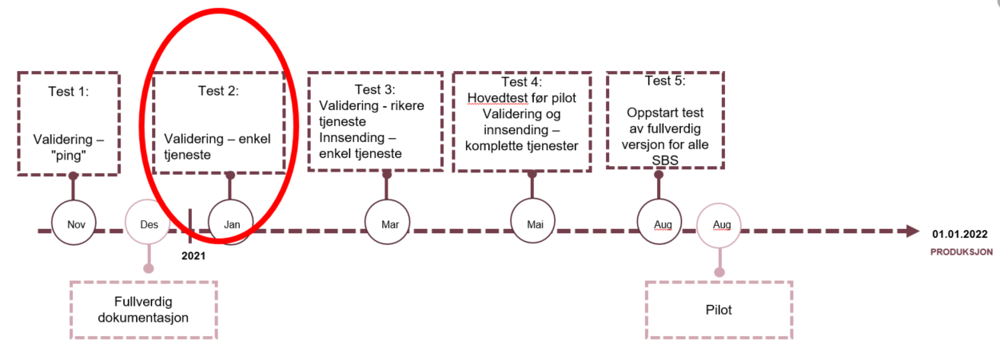

Vi har kommet til 'Test 2'. Se lenger ned på siden for fullstendig testplan. Vi har klar valideringstjenesten med noen av de valideringene denne tjenesten skal inneholde.
Testdokumentasjonen består av

- Beskrivelse av api - https://skatteetaten.github.io/mva-meldingen/documentation/api/
- XSD - https://skatteetaten.github.io/mva-meldingen/documentation/informasjonsmodell/
- Valideringsregler - https://skatteetaten.github.io/mva-meldingen/documentation/forretningsregler/
- Valideringsregler som er en del av testen – se lenger ned på denne siden
- Eksempler på testtilfeller – se lenger nede på denne siden
- I tillegg er det behov for testbruker. Dette distribueres direkte til de som skal være med å teste.

For de tidlige testene hvor et fåtall av systemleverandørene er involvert, vil informasjon om test og testgjennomføring tas direkte med de involverte.

Resultatet av de tidlige testene vil dokumenteres og informasjon om dette vil være tilgjengelig for alle som ønsker å følge med underveis.

# Valderingsregler

Valideringsregler klare for test:

- Summen av beregnet avgift fra hver avgiftslinje skal være lik sum avgift i Mva-meldingen
- Beregnet avgift skal stemme med oppgitt grunnlag ganger gjeldende sats

# Testtilfeller mva-melding

Se eksempler på testtilfeller for ny mva-melding [testtilfeller for ny mva-melding](Testtilfeller mva-melding.xlsx)

Eksempler på xml-filer: https://github.com/Skatteetaten/mva-meldingen/blob/master/docs/documentation/test/eksempler/
Inntil videre skal det ikke være %-tegn i fila dere sender inn

# Testplan

## Innhold i testen

Konkret må sluttbrukersystemet gjøre følgende:

1. Få etablert et kundeforhold hos Digitaliseringsdirektoratet (DigDir) og ta i bruk ID-porten.
2. Logge inn hos ID-porten for å få en sesjon (og token).
3. Utvikle en applikasjon/klient som:
   - Sende en request til Skatteetatens tjeneste for å validere en mva-melding.

Skatteetaten har tilgjengeliggjort en testapplikasjon som viser hvordan trinnene beskrevet over kan utføres.
Den er skrevet i [jupyter notebook formatet](https://jupyter.org/):

1. [Jupyter notebook demo for henting, validering og innsending](https://github.com/Skatteetaten/mva-meldingen/tree/master/docs/documentation/test/demo.ipynb). Last ned katalogen testinnsending og kjør skriptet demo.ipynb (skriptet vil utføre alle trinn som inngår i prosessen: kalle ping tjeneste å sjekke kobling og validere mva-melding)
2. [Pyton skript å hent token](https://github.com/Skatteetaten/mva-meldingen/blob/master/docs/documentation/test/hent.py) og [postman skript å validere melding](https://github.com/Skatteetaten/mva-meldingen/blob/master/docs/documentation/test/MeldingValidering.postman_collection.json). Første logge inn hos ID-Porten (se nedover), og da lagre token i format "Bearer <em>hentet-token</em>" som miljø variabel med navn "test-bearer" i postman, og bruk postman skript å validere melding.
3. [Eksempel XML-er](https://github.com/Skatteetaten/mva-meldingen/tree/master/docs/documentation/test/eksempler)

## Ta i bruk ID-porten

Det første som en konsument av skattemeldings-API må gjøre er å etablere et kundeforhold hos Digitaliseringsdirektoratet (DigDir). Detaljer rundt hvordan ta i bruk ID-porten er beskrevet her: https://samarbeid.difi.no/felleslosninger/id-porten/ta-i-bruk-id-porten. Denne prosessen er delvis manuell så det er lurt å starte prosessen tidlig slik at dere kan komme i gang med testingen. Ved bestilling må dere oppgi at dere ønsker tilgang til skattemeldings-API fra skatteetaten.

Et kundeforhold hos DigDir gir tilgang til deres selvbetjeningsløsning som igjen gir tilgang til administrasjon av Kundens bruk av ID-porten. I selvbetjeningsløsning kan kunden genere et såkalt client_id og definere et callback-url:

- client_id: er unik automatisk generert identifikator for tjenesten.
- callback-url: Uri-en som klienten får lov å gå til etter innlogging. Etter en vellykket innlogging i ID-porten vil denne url-en bli kalt.
  Dersom det skulle ta for lang tid å få opprettet et kundeforhold hos DigDir kan sluttbrukersystemene i mellomtiden benytte Skatteetatens client_id. For denne testen har Skatteetaten opprettet følgende client_id som kan benyttes av sluttbrukersystemene:

      - `client_id: 38e634d9-5682-44ae-9b60-db636efe3156`
      - Callback-URL til denne client_id er satt til http://localhost:12345/token (Hvis det er konsumenter som ønsker andre callback-URL kan vi ordne det)

**Nyttige lenker:**

- Klienten bruker test-miljøet i DigDir, "verifikasjon 2": https://samarbeid.difi.no/node/232
- OIDC-integrasjonen er beskrevet her: https://difi.github.io/felleslosninger/oidc_index.html
- Hvordan lage en klient i selvregistreringen: https://minside-samarbeid.difi.no/organization-home/services/service-admin#/

## Logge inn hos ID-porten

Klienten må foreta følgende REST kall mot ID-porten:

- Starte system browser og gjøre autorisasjonskall mot ID-porten. Les mer om det her: https://difi.github.io/felleslosninger/oidc_protocol_authorize.html
- Brukeren blir da sendt til ID-porten for innlogging. Dere kan benytte eksisterende test-brukere som dere benytter til test mot skattemeldingen i dag.
- Sette opp en webserver som venter på callback fra browseren. Etter vellykket pålogging i ID-porten sendes brukes til denne webserveren. Denne webserveren må være satt til å lytte på callback-URL http://localhost:12345/token (ref. forrige kapittel).
- Gjøre et tokenforespørsel. Les mer om det her: https://difi.github.io/felleslosninger/oidc_protocol_token.html

Vi benytter følgende testmiljø hos ID-porten:

- /authorize endpoint: https://oidc-ver2.difi.no/idporten-oidc-provider/authorize
- /token endpoint: https://oidc-ver2.difi.no/idporten-oidc-provider/token

For detaljer rundt hvilken HTTP parametere som må sendes med i kallet, se filen [hent.py](hent.py)

## Kalle skattemeldings-API

Når callback-URL blir kalt må klienten plukke ut JWT-tokenet fra responsen og legge det i header-feltet Authorization og kalle mva-meldings-API. For detaljer, se [demo klient](demo.ipynb)

URL til skattemeldings-API i test er: https://mp-test.sits.no/

[comment]: <> (Første testen bør være å teste at klienten når frem, dette kan gjøres ved å kalle ping tjenesten:)

[comment]: <> (- `GET https://<env>/api/mva/mva-melding/ping`)

[comment]: <> (- `Eksempel: GET https://mp-test.sits.no/api/mva/mva-melding/ping`)

# Tidsplan for test

Tidsplanen under viser når det vi være mulig å teste integrasjonene mot Skatteetaten sine nye løsninger.

<table align=center>
  <tr><th align=center>Hva</th><th align=center>Når</th><th align=center>Innhold</th></tr>
  <tr><td>Dokumentasjon XSD</td><td>28.09.2020</td><td><ul><li>Oppdatert xsd etter tilbakemeldinger i møte 14.9</li></ul></td></tr>
  <tr><td>Test 1 – teknisk verifikasjon</td><td>nov. 2020</td><td><ul><li>Valideringstjeneste -"Dummy"  (Ping fra SBS)</li></ul></td></tr> 
  <tr><td>Test 2 – syltynn valideringstjeneste og teknisk verifikasjon av innsendingstjenesten</td><td>jan. 2021</td>
  <td> 
  <ul>
	<li>Valideringstjeneste </li>
	<li>Helt enkel tjeneste med en eller få enkle valideringer </li>
  </ul>
  </td></tr>
  <tr><td>Test 3 - noe rikere valideringstjeneste og en enkel innsendingstjeneste</td><td>mar. 2021</td>
  <td>  
  <ul>
	<li>Valideringstjeneste - Valideringstjeneste som inneholder mange av de valideringene som skal brukes</li>
	<li>Innsendingstjeneste - Enkel innsendingstjeneste som skal verifisere innsendingen og gi kvittering tilbake</li>
  </ul>
  </td></tr>
  <tr><td>Test 4 – komplett tjeneste</td><td>mai.  2021</td><td>
  <ul>
	<li>Valideringstjeneste - Komplett tjeneste, sånn den skal være til pilot, er på plass</li>
	<li>Innsendingstjeneste - Komplett tjeneste, sånn den skal være til pilot, er på plass</li>
  </ul>
  </td></tr>
  <tr><td>Test 5 - hovedtest før pilot</td><td>aug. 2021</td><td></td></tr>
  <tr><td>Pilot</td><td>aug. 2021</td><td></td></tr>
  <tr><td>Produksjon</td><td>01.01.2022</td><td></td></tr>  
</table>

